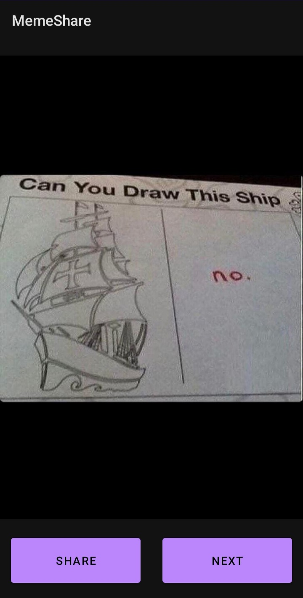
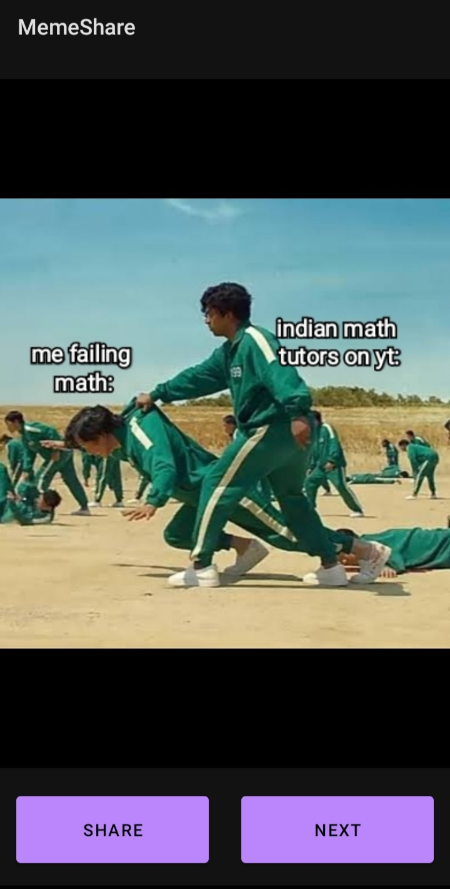
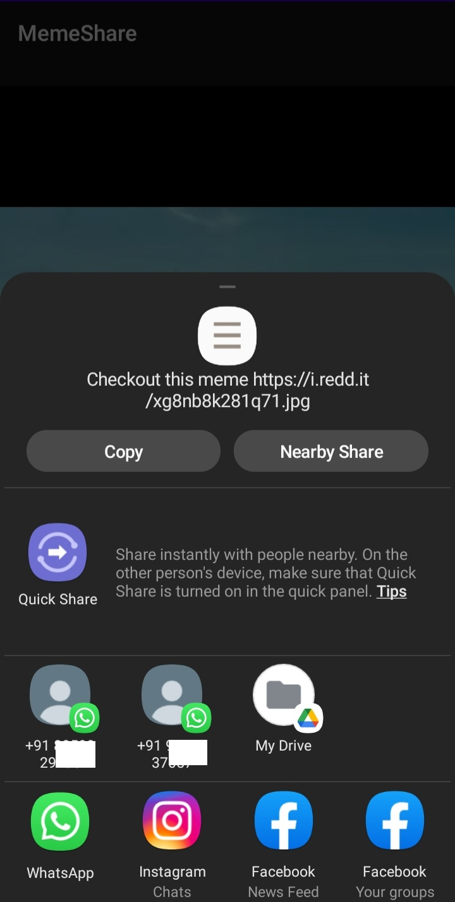

# Meme-Share-App
Through this app user is able to view various funny MEME'S and can also share them with his/her friends through various social media app's. This app is build using Kotlin programming language.

The concept's and libraries that are used for developing this app are: 
      1] Glide Library – Image Loading Library For Android. 
      2] Intents (Especially Implicit Intent). 
      3] Volley - It is an HTTP library that makes networking very easy and fast, for Android apps. 
      4] Working With API's. (extracting Meme's from Reddit)

## View Meme's
<table>
   <tr>
    <td>View and Enjoy funny Meme's</td>
    <td>Click Next Button for more</td>
  </tr>
  <tr>
    <td></td>
    <td></td>
  </tr>
 </table>
 
 
 
## Share with Friends and Family
<table>
   <tr>
    <td>Click Share button</td>
  </tr>
  <tr>
    <td></td>
  </tr>
 </table>
